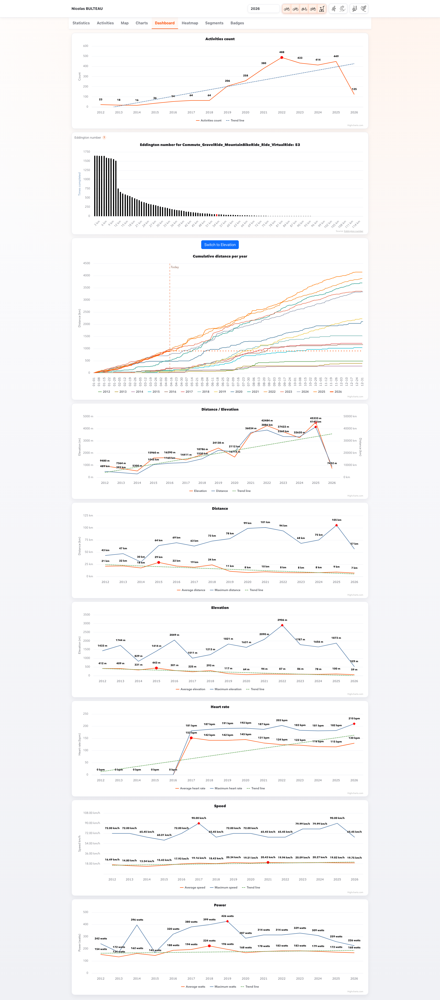
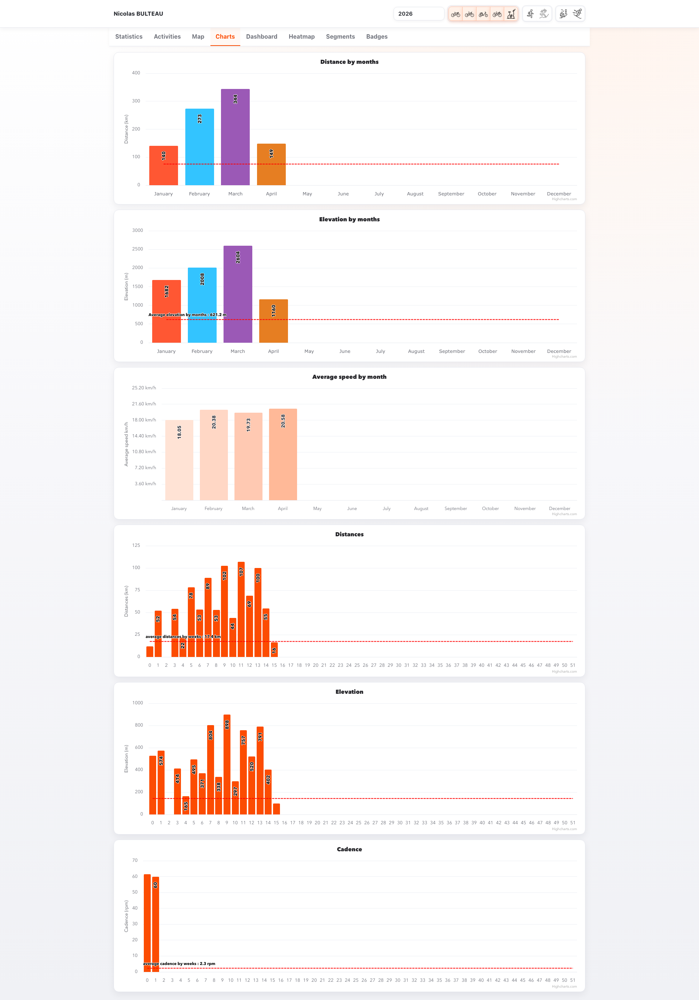
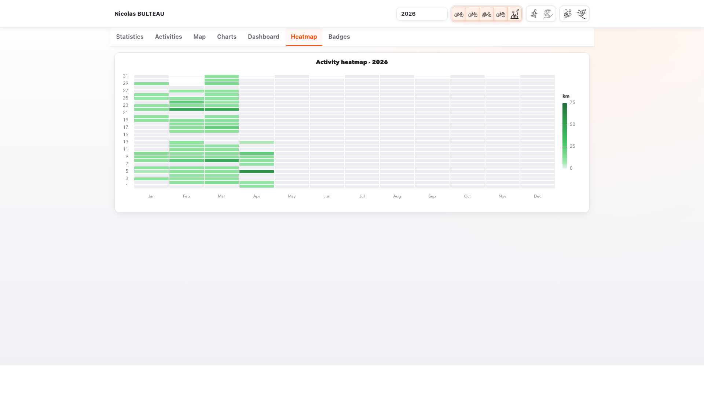
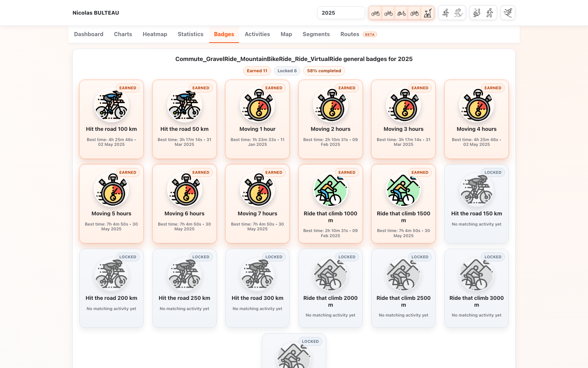
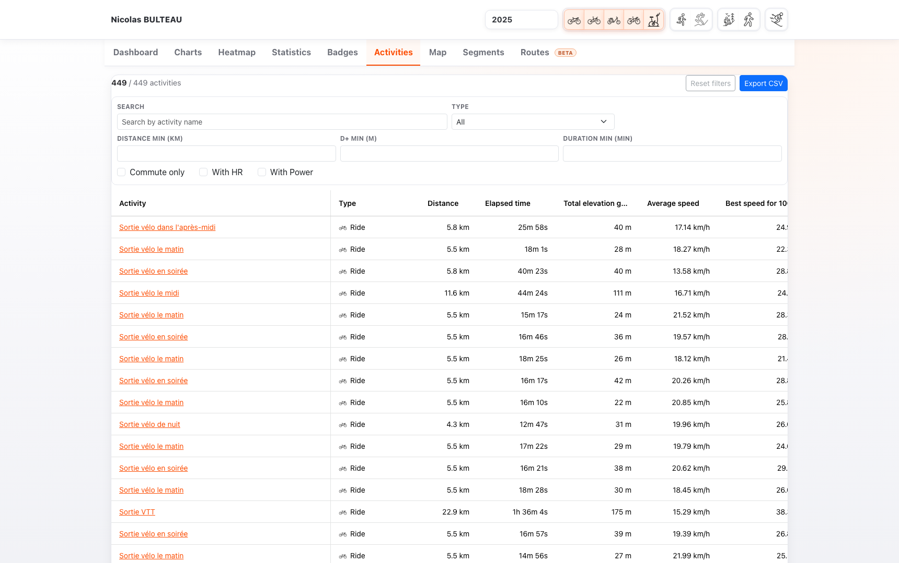

# MyStravaStats

MyStravaStats is a personal analytics application for Strava activities.
It lets you explore rides, runs, hikes, inline skating sessions, ski activities, maps, charts, badges, dashboards, and best-effort statistics computed from your historical data.

## What The Product Does

MyStravaStats can:
- load activities from Strava
- reuse a local cache to avoid downloading the full history every time
- refresh cache asynchronously across all years (current year first, then older years)
- work from GPX or FIT files in the Kotlin backend
- compute global statistics and sport-specific statistics
- calculate best efforts from activity streams
- build a chronological personal-records timeline (when each PR was set, then improved)
- analyse heart-rate zones (per activity, per month, per year) with custom athlete settings
- analyse training load with a heatmap by day (distance, elevation, or duration)
- compare heatmap results between years with monthly deltas
- generate advanced heatmap insights (consistency, streaks, momentum, best week, weekday signature, activity mix)
- show dashboards, charts, maps, badges, and detailed activity views
- export filtered activities to CSV
- switch immediately to cache-only mode when Strava returns `429` (rate limit), then resume after cooldown

Examples of metrics already available:
- total distance, elevation, moving time, active days, streaks
- Eddington number
- best effort by distance or by time
- personal-records timeline events by sport, year, and metric
- heart-rate zone time distribution and easy-vs-hard training ratio trends
- best climbing gradient on a target distance
- dashboard trends by year
- heatmap consistency ratio, longest streak, and longest inactivity break
- weekly momentum (last weeks vs previous weeks)
- route visualisation and activity detail charts

## Repository Layout

The repository currently contains three major parts:

- [front-vue](/Users/nicolas/Workspace/mystravastats-2/front-vue): Vue 3 frontend
- [back-kotlin](/Users/nicolas/Workspace/mystravastats-2/back-kotlin): Spring Boot + Kotlin backend
- [back-go](/Users/nicolas/Workspace/mystravastats-2/back-go): Go backend with a similar API to the Kotlin backend

In practice:
- the Kotlin backend is the richer and more extensible backend
- the Go backend still exists and is still wired into some packaging scripts
- the frontend talks to a backend through `/api/...`

## Architecture Overview

### Frontend

The frontend is implemented in Vue 3 with Vite and Pinia.

Main areas:
- dashboard
- charts
- heatmap
- statistics
- badges
- activities
- map
- segments
- routes (beta)
- detailed activity view

Useful entry points:
- [main.ts](/Users/nicolas/Workspace/mystravastats-2/front-vue/src/main.ts)
- [App.vue](/Users/nicolas/Workspace/mystravastats-2/front-vue/src/App.vue)
- [context.ts](/Users/nicolas/Workspace/mystravastats-2/front-vue/src/stores/context.ts)

### Kotlin backend

The Kotlin backend is a Spring Boot application with:
- REST controllers in [api/controllers](/Users/nicolas/Workspace/mystravastats-2/back-kotlin/src/main/kotlin/me/nicolas/stravastats/api/controllers)
- business services in [domain/services](/Users/nicolas/Workspace/mystravastats-2/back-kotlin/src/main/kotlin/me/nicolas/stravastats/domain/services)
- data providers in [activityproviders](/Users/nicolas/Workspace/mystravastats-2/back-kotlin/src/main/kotlin/me/nicolas/stravastats/domain/services/activityproviders)
- Strava and local-cache adapters in [adapters](/Users/nicolas/Workspace/mystravastats-2/back-kotlin/src/main/kotlin/me/nicolas/stravastats/adapters)

It supports three data sources:
- Strava API + local cache
- GPX files
- FIT files

### Go backend

The Go backend exposes a similar API and is still relevant for some build flows.
It is simpler architecturally, but less flexible than the Kotlin backend.

## FIT Power Metrics

The Go and Kotlin FIT adapters now use the same power fallback:

- if the FIT session provides `avgPower`, it remains the source for `averageWatts` and `weightedAverageWatts`
- if `avgPower` is missing or zero, `record.power` samples drive `averageWatts`, `weightedAverageWatts`, and kilojoules
- average power includes zero-power samples, so coasting is preserved, and ignores invalid or negative samples
- weighted power uses a 30-sample rolling normalized-power approximation, with a plain average fallback for shorter streams
- kilojoules keeps the existing app convention: `0.8604 * averageWatts * elapsedSeconds / 1000`

Known limits:
- devices that do not record power keep these metrics at zero
- devices that record FIT power below or above 1 Hz can slightly shift the weighted-power approximation because the rolling window is record-count based

## Cache Refresh And Reliability

Both backends now use the same reliability strategy for background refresh:

- startup is cache-first (fast local load)
- background refresh runs asynchronously for all years (from current year down to oldest)
- missing streams and missing detailed activities are backfilled in background
- on the first Strava `429`, network refresh switches to immediate cache-only mode
- background backfills stop early on `429` instead of retrying aggressively

This improves perceived startup performance while protecting the app from noisy rate-limit retry loops.

## OSM Routing Engine (OSRM)

The Routes target generator can use an external road graph engine (OSRM) in both backends.

Implementation details and setup instructions are documented here:

- [OSM Routing Setup](./osm-routing-setup.md)
- [Route Generation Engine (Unified Spec)](./route-generation-engine.md)

## Screenshots

Dashboard:



Charts:



Heatmap:



Statistics:


Badges:



Activities:



Map:


Segments:


Detailed activity:


The detailed-activity screenshot above reflects the V1.1 layout (hero summary, effort panel, and profile chart), captured on activity `15340076302`.

Icons made by [Flaticon](https://www.flaticon.com).

## Quick Start For Non-Developers

If you simply want to build and run the application, the easiest path is to use one of the provided build scripts:

- [build-go-macos.zsh](/Users/nicolas/Workspace/mystravastats-2/build-go-macos.zsh)
- [build-go-ubuntu.sh](/Users/nicolas/Workspace/mystravastats-2/build-go-ubuntu.sh)
- [build-go-windows.ps1](/Users/nicolas/Workspace/mystravastats-2/build-go-windows.ps1)

These scripts are designed to prepare the application for your platform.
They rely on Docker, so Docker must be installed and running before you launch them.

### Step 1: Install Docker

#### macOS

Install Docker Desktop for Mac:
- official guide: [Install Docker Desktop on Mac](https://docs.docker.com/desktop/setup/install/mac-install/)

Beginner-friendly summary:
- download Docker Desktop for your Mac
- open the installer
- move Docker to the Applications folder
- launch Docker Desktop once
- wait until Docker says it is running

#### Ubuntu

Install Docker Engine on Ubuntu:
- official guide: [Install Docker Engine on Ubuntu](https://docs.docker.com/engine/install/ubuntu/)

Beginner-friendly summary:
- install Docker following the official Ubuntu instructions
- make sure the Docker service is started
- verify Docker works with `docker --version`

#### Windows

Install Docker Desktop for Windows:
- official guide: [Install Docker Desktop on Windows](https://docs.docker.com/desktop/setup/install/windows-install/)

Beginner-friendly summary:
- install Docker Desktop
- enable WSL 2 if Docker asks for it
- launch Docker Desktop once
- wait until Docker says it is running

### Step 2: Run the build script for your platform

Pick your backend first:
- `Go` backend build scripts create `mystravastats` (or `mystravastats.exe` on Windows)
- `Kotlin` backend build scripts create `mystravastats-kotlin-*` binaries

Then run the matching script for your OS.

#### macOS (Apple Silicon)

```sh
./build-go-macos.zsh
```

#### Ubuntu / Linux

```sh
./build-go-ubuntu.sh
```

If needed, fix ownership of the generated binary:

```sh
sudo chown $(whoami):$(whoami) mystravastats
```

#### Windows

```powershell
.\build-go-windows.ps1
```

### Step 3: Run the generated application

#### Go backend binary

```sh
./mystravastats
```

On Windows:

```powershell
mystravastats.exe
```

#### Kotlin backend binary

On macOS:

```sh
./mystravastats-kotlin-macos-arm64
```

On Ubuntu / Linux:

```sh
./mystravastats-kotlin-ubuntu
```

On Windows:

```powershell
mystravastats-kotlin-windows.exe
```

Then open:
- [http://localhost:8080/](http://localhost:8080/)

## Running The Project As A Developer

## Supported Toolchain Versions

Use the same toolchain versions in local development, CI, Docker, and release scripts:

| Area | Version source | Supported version |
|---|---|---|
| Go backend | `back-go/go.mod` | Go `1.26.2` |
| Kotlin backend | `back-kotlin/build.gradle.kts` | Java `25` |
| Kotlin build | `back-kotlin/gradle/wrapper/gradle-wrapper.properties` | Gradle `9.4.1` |
| Frontend | `front-vue/package.json` | Node.js `>=25.9.0` |

Dockerfiles, GitHub Actions, and the Go binary build scripts are expected to stay aligned with these manifests. The CI runs `scripts/check-toolchains.sh` to catch version drift.

## Option 1: Kotlin backend

Run the frontend and Kotlin backend stack:

- Docker Compose: [docker-compose-kotlin.yml](/Users/nicolas/Workspace/mystravastats-2/docker-compose-kotlin.yml)
- Backend project: [back-kotlin](/Users/nicolas/Workspace/mystravastats-2/back-kotlin)

Docker command from the repository root:

```sh
docker compose -f docker-compose-kotlin.yml up --build
```

Typical local command:

```sh
cd back-kotlin
./gradlew build
./gradlew bootRun
```

## Option 2: Go backend

Run the frontend and Go backend stack:

- Docker Compose: [docker-compose-go.yml](/Users/nicolas/Workspace/mystravastats-2/docker-compose-go.yml)
- Backend project: [back-go](/Users/nicolas/Workspace/mystravastats-2/back-go)

Docker command from the repository root:

```sh
docker compose -f docker-compose-go.yml up --build
```

Typical local command:

```sh
cd back-go
go test ./...
go run .
```

## Docker Runtime Mode

Both Docker stacks use the same runtime shape:
- the frontend container serves the UI on [http://localhost/](http://localhost/)
- Nginx proxies `/api/...` to the backend service at `http://back:8080`
- the backend remains directly reachable on [http://localhost:8080/](http://localhost:8080/)
- `STRAVA_CACHE_PATH` defaults to `./strava-cache` when it is not defined
- browser auto-open is disabled inside containers; the authorization URL is printed in logs when needed

Useful checks:

```sh
curl -fsS http://localhost/api/health/details
docker compose -f docker-compose-go.yml ps
docker compose -f docker-compose-kotlin.yml ps
```

After OSRM data has been prepared, route generation can use the optional OSRM compose file:

```sh
docker compose -f docker-compose-go.yml -f docker-compose-routing-osrm.yml up --build
docker compose -f docker-compose-kotlin.yml -f docker-compose-routing-osrm.yml up --build
```

The backend containers default to `OSM_ROUTING_BASE_URL=http://osrm:5000`, and the OSRM service joins the same Docker network when the compose files are combined.

Smoke checks are available for both stacks:

```sh
./scripts/smoke-docker-compose.sh go
./scripts/smoke-docker-compose.sh kotlin
```

## Frontend Development

```sh
cd front-vue
npm install
npm run dev
```

Useful checks:

```sh
npm run type-check
```

## Strava Configuration

To access your Strava data, MyStravaStats needs a Strava API application linked to your own Strava account.

Create it from:
- [Strava API Settings](https://www.strava.com/settings/api)

### Step 1: Create your Strava application

On the Strava API settings page, create an application and fill the required information.

The most important values for MyStravaStats are:
- `clientId`
- `clientSecret`

You can usually use any valid values for the descriptive fields of the Strava application, but you must keep the generated `clientId` and `clientSecret`.

### Step 2: Locate the cache directory

By default, MyStravaStats uses:
- `strava-cache`

If you define `STRAVA_CACHE_PATH`, then the application uses that directory instead.

### Step 3: Create the `.strava` file

Inside the cache directory, create a file named:
- `.strava`

Example:

```text
strava-cache/.strava
```

or, if you use a custom cache path:

```text
/your/custom/cache/.strava
```

### Step 4: Put your Strava credentials in the file

Typical `.strava` content:

```properties
clientId=YOUR_CLIENT_ID
clientSecret=YOUR_CLIENT_SECRET
useCache=false
```

### Meaning of each property

`clientId`
- the Strava application identifier
- mandatory if you want to connect MyStravaStats to Strava

`clientSecret`
- the secret of your Strava application
- required when the application must download fresh data from Strava

`useCache`
- `false`: MyStravaStats is allowed to call Strava and refresh missing data
- `true`: MyStravaStats prefers the local cache and avoids a live Strava bootstrap

### Recommended values

For a first import:

```properties
clientId=YOUR_CLIENT_ID
clientSecret=YOUR_CLIENT_SECRET
useCache=false
```

For offline or cache-first usage after data has already been downloaded:

```properties
clientId=YOUR_CLIENT_ID
clientSecret=YOUR_CLIENT_SECRET
useCache=true
```

### First launch: what happens

On the first real Strava-enabled launch:
- MyStravaStats reads the `.strava` file
- it opens a browser to the Strava authorization screen
- you log in and approve access
- Strava redirects back to a local callback URL
- MyStravaStats receives an access token
- the application starts downloading activities into the local cache

If the browser does not open automatically, MyStravaStats prints the authorization URL in the terminal so you can open it manually.

### Important notes

- The first import may take time if you have many years of activities.
- Streams and detailed activities may be filled progressively.
- Because of Strava rate limits, a full import may require more than one run.
- If `clientSecret` is missing, MyStravaStats can only rely on already cached data.
- If `useCache=true` but the cache is empty, you will not get a full live import experience.

### Typical cache content after synchronization

The cache directory may contain:
- athlete profile data
- yearly activities JSON files
- detailed activity files
- stream files

This is why later launches are faster than the first one.

## Runtime Configuration

Runtime configuration is centralized in the backend diagnostics payload. `GET /api/health/details` exposes non-sensitive effective values under `runtimeConfig`, and the Diagnostics page renders the same information.

| Variable | Go backend | Kotlin backend | Default | Notes |
| --- | --- | --- | --- | --- |
| `STRAVA_CACHE_PATH` | yes | yes | `strava-cache` | Strava cache directory. |
| `FIT_FILES_PATH` | yes | yes | unset | Selects the FIT provider when set. |
| `GPX_FILES_PATH` | reported only | yes | unset | Selects the GPX provider in Kotlin. Go reports the value but does not support GPX files yet. |
| `CORS_ALLOWED_ORIGINS` | yes | yes | `http://localhost,http://localhost:5173` | Comma-separated list of explicit allowed browser origins. CORS credentials are enabled, and `Content-Type`, `Authorization`, and `X-Request-Id` are allowed headers. |
| `OPEN_BROWSER` | yes | yes | `true` | Set to `false` in Docker or headless runs. |
| `SERVER_HOST` / `HOST` | yes | no | `localhost` | Go listen host. `SERVER_HOST` wins over `HOST`. |
| `PORT` | yes | reported fallback | `8080` | Go listen port. Kotlin reports it only as a fallback when `SERVER_PORT` is absent. |
| `SERVER_ADDRESS` | no | yes | `0.0.0.0` | Kotlin listen address. |
| `SERVER_PORT` | no | yes | `8080` | Kotlin listen port. |
| `OSM_ROUTING_ENABLED` | yes | yes | `true` | Enables OSRM-backed routing checks and route generation. |
| `OSM_ROUTING_BASE_URL` | yes | yes | `http://localhost:5000` | Docker compose overrides this to the OSRM service URL. |
| `OSM_ROUTING_TIMEOUT_MS` | yes | yes | `3000` | Go rejects values below `200`; Kotlin clamps values below `300` to `300`. |
| `OSM_ROUTING_PROFILE` | yes | yes | unset | Optional routing profile override. |
| `OSM_ROUTING_EXTRACT_PROFILE` | yes | yes | unset | Optional extract profile name. |
| `OSM_ROUTING_EXTRACT_PROFILE_FILE` | yes | yes | `./osm/region.osrm.profile` | OSRM extract profile path used for diagnostics. |
| `OSM_ROUTING_V3_ENABLED` | yes | yes | `true` | Enables the v3 route-generation pipeline. |
| `OSM_ROUTING_DEBUG` | yes | yes | `false` | Adds verbose routing diagnostics. |
| `OSM_ROUTING_HISTORY_BIAS_ENABLED` | yes | yes | `false` | Treats historical routes as a positive signal when enabled. |
| `OSM_ROUTING_HISTORY_HALF_LIFE_DAYS` | yes | yes | `75` | Decay window for historical route weighting. |
| `API_BACKEND_URL` | frontend Docker | frontend Docker | `http://back:8080` | Backend upstream used by the Docker frontend Nginx proxy. |
| `https_proxy` / `HTTPS_PROXY` | no | yes | unset | Proxy support for Strava API access in the Kotlin backend. |

## Cache Behavior

The project stores data locally to avoid re-downloading everything from Strava.

What is cached:
- athlete profile
- yearly activity lists
- activity details
- activity streams

General behavior:
- the first import can take time if the history is large
- yearly activity files are reused when possible
- missing details and streams are loaded progressively
- some data may need several runs because of Strava API rate limits

Default cache directory:
- `strava-cache`

## Strava OAuth Flow

When the application needs access to Strava:
- it opens a browser on the Strava consent page
- Strava redirects back to a local callback server
- the backend exchanges the authorization code for an access token

If the browser does not open automatically, the application prints the authorization URL in the terminal.

## Troubleshooting

### Browser does not open

Copy the OAuth URL shown in the terminal and open it manually in a browser.

### Rate limit reached

Strava applies request limits.
If you are importing a long history, let the cache fill progressively and retry later.

Reference:
- [Strava rate limits](https://developers.strava.com/docs/rate-limits/)

### Empty or partial cache

Check:
- the `.strava` file exists in the selected cache directory
- `clientId` is correct
- `clientSecret` is correct if live Strava access is expected
- `useCache` is not forcing stale local-only behavior unexpectedly
- for the Segments tab specifically: detailed activity files (`stravaActivity-*`) must exist for the years you expect

### Wrong backend or wrong ports

If the frontend loads but API calls fail, verify:
- which backend is running
- which Docker Compose file or build script you used
- whether the backend is exposing `/api`
- whether the Docker frontend can reach `/api/health/details` through Nginx
- whether `docker compose ps` reports healthy backend and frontend containers

### Build succeeds in one environment but not another

Check:
- local Java / Node / Go versions match the supported toolchain table above
- Gradle wrapper availability
- network access for Gradle dependency downloads
- local filesystem permissions for `~/.gradle` or cache directories

## Metrics And Statistics

The application exposes several families of metrics:
- global statistics
- activity-type-specific statistics
- best efforts by distance
- best efforts by duration
- chronological personal-records timeline events
- next actions for personal records and Eddington
- climbing and elevation metrics
- yearly dashboard summaries
- badges and famous climbs

### Global Metrics

Examples:
- total number of activities
- number of active days
- total distance
- total elevation
- elapsed time
- longest streak
- most active month

### Best Efforts

Best efforts are computed with sliding-window analysis on activity streams.
That means the application does not only look at laps or manually split sections: it scans the full activity stream to find the strongest continuous segment for a target distance or duration.

Examples:
- best 1 km
- best 5 km
- best 1 hour
- best 2 hours
- best average power for 20 minutes
- best climbing gradient for 1 km

### Personal Records Timeline

The statistics page also exposes a chronological timeline of PR events.
For each metric, the timeline shows:
- when the metric first got a valid PR
- when that PR was beaten later
- the previous value and the improvement amount
- the activity that set the PR

You can filter the timeline by:
- sport (via activity type selection)
- year
- metric key

Useful API endpoint:
- `/api/statistics/personal-records-timeline?activityType=...&year=...`

### What Is Next

The dashboard includes a compact "What is next?" section.

It combines:
- the closest personal-record targets, ranked by how close the next-best historical effort is to the current PR
- the current Eddington number and the missing days needed for the next level
- a target distance for Eddington based on `E+1`, with the historical solid-day distance shown as context

Useful API endpoint:
- `/api/statistics/what-is-next?activityType=...`

### Heart Rate Zone Analysis

The statistics page now includes a dedicated heart-rate zone analysis block.

It provides:
- zone time per activity
- zone distributions aggregated by month and by year
- easy-vs-hard ratio trends (easy = Z1 + Z2, hard = Z4 + Z5)

You can configure athlete-specific zone inputs:
- max HR
- threshold HR
- reserve HR

Configuration is persisted per athlete in the local cache and reused on the next launch.

Where settings are stored:
- `<STRAVA_CACHE_PATH>/strava-<clientId>/heart-rate-zones-<clientId>.json`
- if `STRAVA_CACHE_PATH` is not set, the default root is `strava-cache`

How MyStravaStats resolves the method and values actually used:
1. if `Threshold HR` is set, method is `THRESHOLD` (highest priority)
2. else if `Max HR` and `Reserve HR` are both valid, method is `RESERVE`
3. else if `Max HR` is set, method is `MAX`
4. else `Max HR` is derived from activities (highest observed activity max HR), method is `MAX` with source `DERIVED_FROM_DATA`

Important UI detail:
- the Statistics panel displays **Resolved Max HR** (the effective max HR really used by calculations)
- this value can come from your saved settings or be derived from activity history
- when derived, the source is shown as `Derived from activities`

If a setting is empty or invalid:
- non-positive values are ignored
- empty values are treated as "not provided"
- if no usable value can be resolved and no HR streams are available, the analysis stays visible with `HR Data Availability = Unavailable`

Graceful fallback behavior:
- if HR stream data is missing for the selected filters, the section stays visible with an explicit "no data" state
- detailed activity view also falls back cleanly when HR stream is unavailable

Useful API endpoints:
- `GET /api/athletes/me/heart-rate-zones`
- `PUT /api/athletes/me/heart-rate-zones`
- `GET /api/statistics/heart-rate-zones?activityType=...&year=...`

### Eddington Number

The Eddington number is one of the signature metrics of the project and deserves a clear explanation.

Definition:
- your Eddington number is the largest number `E` such that you completed at least `E` days with at least `E` kilometers on each of those days

Example:
- if you have ridden at least `50 km` on `50` different days, your Eddington number is at least `50`
- if you have exactly `50` days at `50 km` or more, and only `49` days at `51 km` or more, then your Eddington number is `50` (not `51`)
- if your best level is only `49` days at `49 km` or more (and not `50` days at `50 km`), then your Eddington number is `49`

How to interpret it:
- it rewards consistency, not only one-off long rides
- it is harder and harder to increase over time
- it gives a simple summary of how deep your endurance history is

In MyStravaStats:
- the metric is available for multiple sports
- it is computed from active days, not from the total number of activities
- multiple activities on the same day contribute to the day total

Why it is interesting:
- total distance can grow quickly with volume, but the Eddington number grows only if you repeat solid days many times
- it is a strong long-term progression metric for endurance athletes
- it is especially motivating because each new level requires one more qualifying day than the previous level

### Dashboard Metrics

The dashboard summarizes yearly progression with metrics such as:
- number of activities per year
- active days per year
- consistency (%) per year
- moving time per year
- total distance per year
- average distance per year
- max distance per year
- total elevation per year
- average elevation per year
- elevation efficiency (`m / 10 km`) per year
- average speed per year
- average heart rate per year
- average watts per year

### Heatmap

The heatmap view provides a calendar-based visualisation of training load:
- metric switch (`Distance`, `Elevation`, `Duration`)
- daily tooltips with aggregate values and activity names
- activity-type icons in each day cell (unique types for that day)
- clickable day inspection panel with activity details and deep links
- year-over-year comparison panel with monthly deltas and total trend summary
- advanced insights panel with consistency, streaks, weekly momentum, weekday signature, top days, activity mix, and best week

### Badges

The badge system highlights milestones and famous climbs.
It turns some statistics into more visual progression markers.

## Further Documentation

Additional documentation is available here:
- [Architecture Diagram](/Users/nicolas/Workspace/mystravastats-2/docs/architecture-diagram.md)
- [OAuth and Cache Troubleshooting](/Users/nicolas/Workspace/mystravastats-2/docs/troubleshooting-oauth-cache.md)
- [Statistics Reference](/Users/nicolas/Workspace/mystravastats-2/docs/statistics-reference.md)
- [Cache Layout for Developers](/Users/nicolas/Workspace/mystravastats-2/docs/cache-layout.md)
