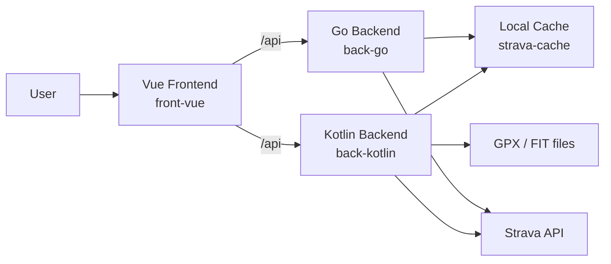
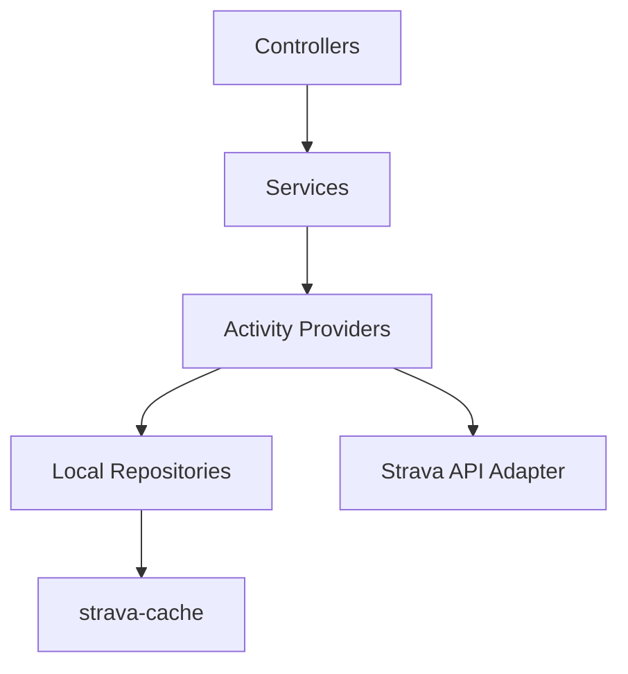

# Architecture Diagram

This page gives a high-level view of how MyStravaStats is structured.

## Main Components

- `front-vue`: user interface
- `back-kotlin`: Spring Boot + Kotlin backend
- `back-go`: Go backend and local binary packaging path
- `strava-cache`: local persisted activity cache
- Strava API: remote activity source

## System Diagram

## Kotlin Backend Layers

## Request Flow

Typical flow for a frontend request:

1. The user changes year, activity type, or view in the frontend.
2. The frontend store builds a request under `/api/...`.
3. The backend resolves the current data source.
4. Activities are read from cache or fetched from Strava when needed.
5. Services compute statistics, charts, dashboard data, badges, or detailed activity data.
6. The frontend renders charts, maps, tables, or detailed views.

## Data Sources

The Kotlin backend supports:
- Strava API
- local Strava cache
- GPX files
- FIT files

The Go backend supports:
- Strava API
- local Strava cache
- FIT files

## Current Practical Status

Today, the repository contains two backend implementations:
- Kotlin is the richest implementation for source-provider variety, especially GPX
- Go still matters for the local binary and should stay aligned on shared behavior

That is why both appear in the repository and in the build flows.

For current support details, see [Backend Capability Matrix](./backend-capability-matrix.md).
