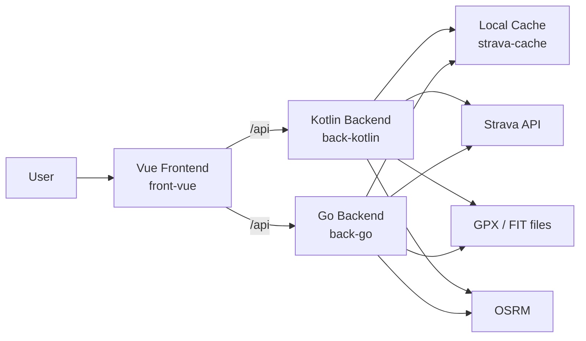
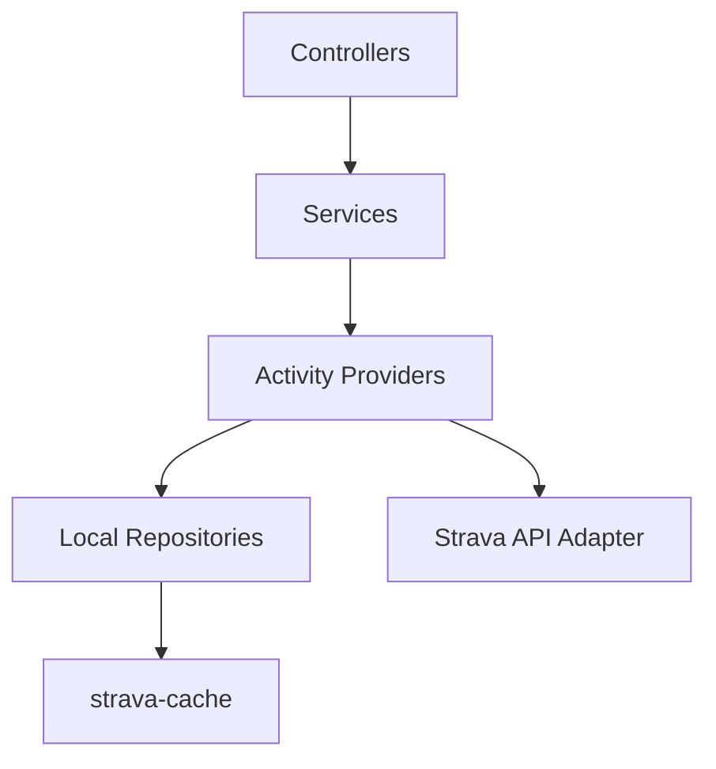

# Architecture Diagram

This page gives a high-level view of how My Activity Stats is structured.

## Main Components

- `front-vue`: user interface
- `back-kotlin`: Spring Boot + Kotlin backend
- `back-go`: Go backend and local binary packaging path
- `strava-cache`: local persisted activity cache
- FIT / GPX directories: local activity sources
- OSRM: local road-routing engine used by GPS Art
- Strava API: remote activity source

## System Diagram

```mermaid
flowchart LR
    U["User"] --> F["Vue Frontend<br/>front-vue"]
    F -->|"/api"| K["Kotlin Backend<br/>back-kotlin"]
    F -->|"/api"| G["Go Backend<br/>back-go"]

    K --> C["Local Cache<br/>strava-cache"]
    G --> C

    K --> S["Strava API"]
    G --> S

    K --> D["GPX / FIT files"]
    G --> D

    K --> O["OSRM"]
    G --> O
```

## Kotlin Backend Layers

```mermaid
flowchart TD
    A["Controllers"] --> B["Services"]
    B --> C["Activity Providers"]
    C --> D["Local Repositories"]
    C --> E["Strava API Adapter"]
    D --> F["strava-cache"]
```

## Request Flow

Typical flow for a frontend request:

1. The user changes year, activity type, or view in the frontend.
2. The frontend store builds a request under `/api/...`.
3. The backend resolves the current data source.
4. Activities are read from cache or fetched from Strava when needed.
5. Services compute statistics, charts, dashboard data, badges, or detailed activity data.
6. The frontend renders charts, maps, tables, or detailed views.

## Data Sources

Both backends support the same source-provider modes:

- Strava API and local Strava cache
- FIT files
- GPX files
- automatic composite mode when two or more sources are explicitly configured

In composite mode, Strava metadata remains canonical for matched activities,
while local FIT/GPX streams can enrich the combined view. Local activities that
do not match a Strava activity remain visible.

## Current Practical Status

Today, the repository contains two backend implementations:

- Kotlin is the historical implementation of several providers and domain services.
- Go is the local binary packaging path and implements the same current source modes.
- Neither backend is the sole reference for every feature; shared API and route-generation
  behavior must remain aligned while the long-term backend strategy is still open.

That is why both appear in the repository and in the build flows.

For current support details, see [Backend Capability Matrix](./backend-capability-matrix.md).

## Architecture Rules

- [ADR 0001](./decisions/0001-dual-backend-contract.md) defines OpenAPI as the authority for the two peer backend implementations.
- [ADR 0002](./decisions/0002-frontend-api-boundary.md) centralizes frontend URL construction and HTTP transport.
- [Module Boundaries and Decomposition Plan](./module-boundaries.md) lists the enforced dependency rules and the order used to break down oversized modules.
