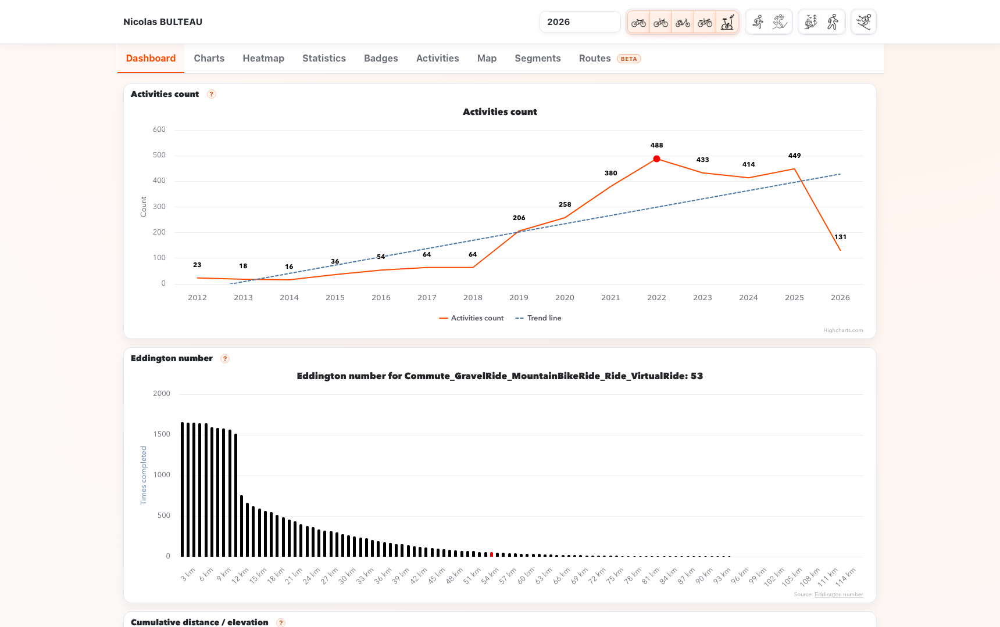
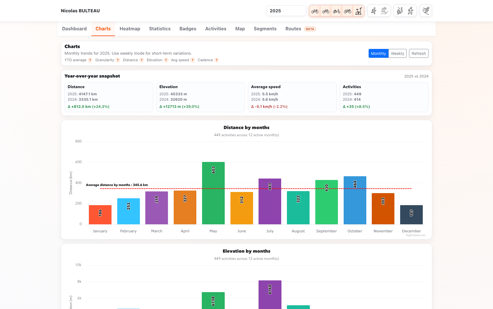
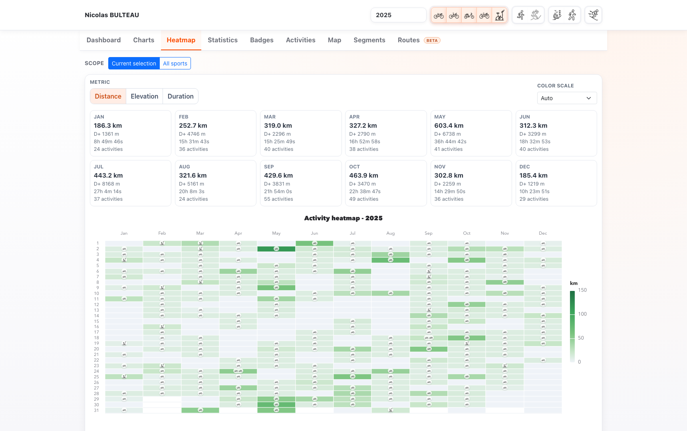
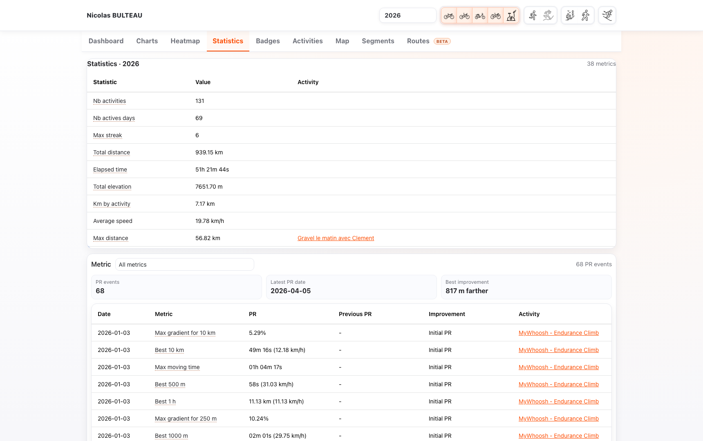
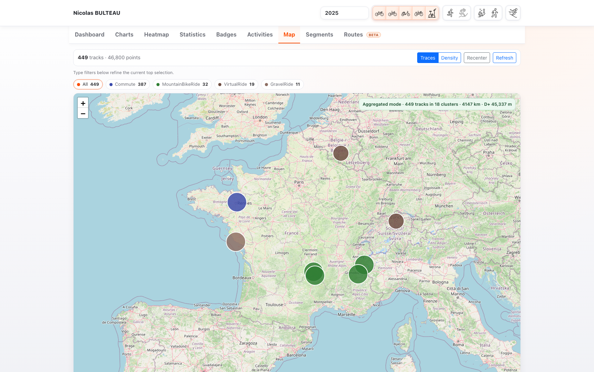
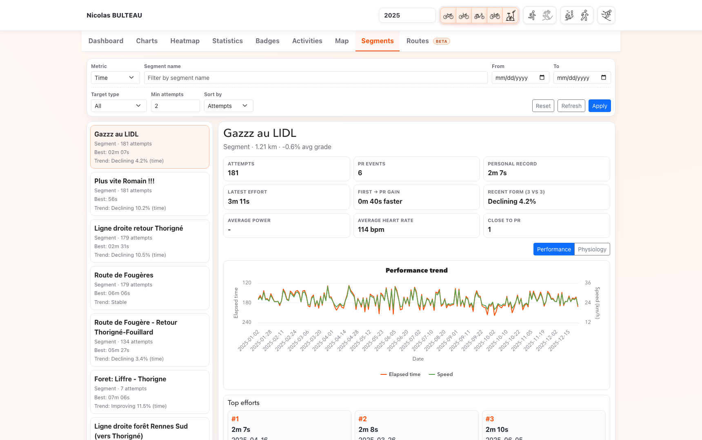
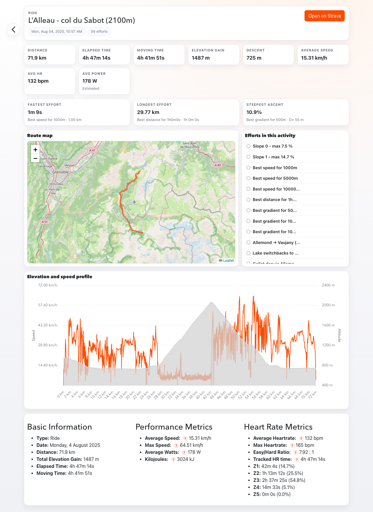

# Screenshots

These screenshots provide a quick visual reference for the current UI.

Dashboard:



Charts:



Heatmap:



Statistics:



Badges:


Activities:


Map:



Segments:



Detailed activity:



The detailed-activity screenshot reflects the V1.1 layout captured on activity `15340076302`.

To refresh screenshots, run:

```sh
node scripts/capture-doc-screenshots.mjs
```
