# Screenshots

These screenshots provide a quick visual reference for the current desktop UI. They were regenerated from the current frontend with the 2025 cycling dataset selected where a year and activity filter applies.

## Overview

Dashboard:

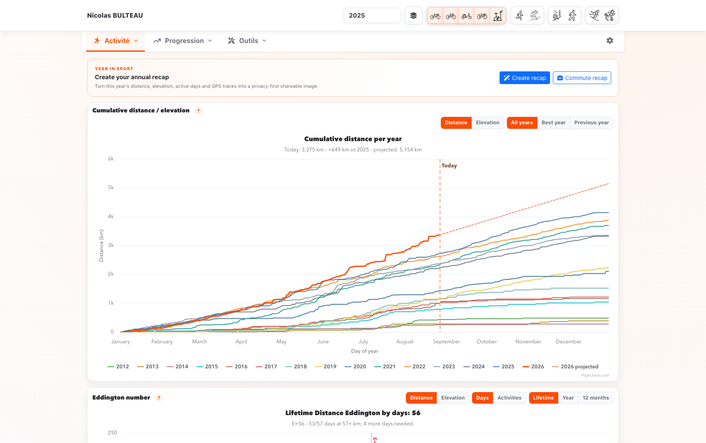

Annual recap:

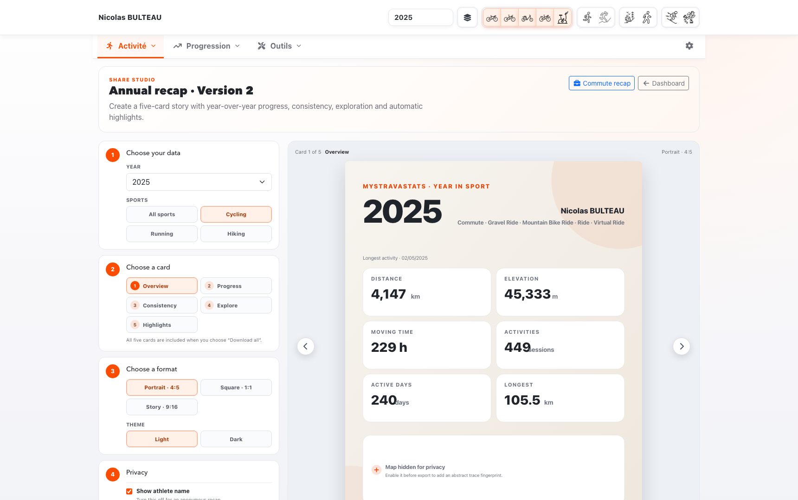

## Activities and maps

Activities:

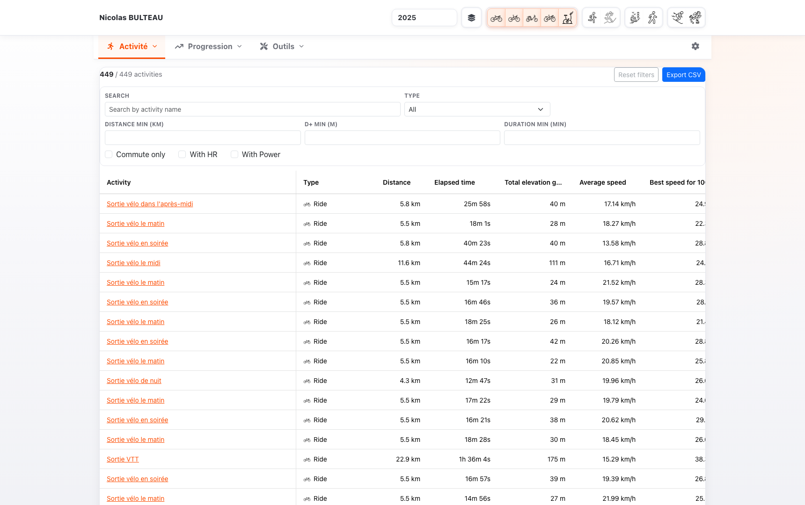

Detailed activity:

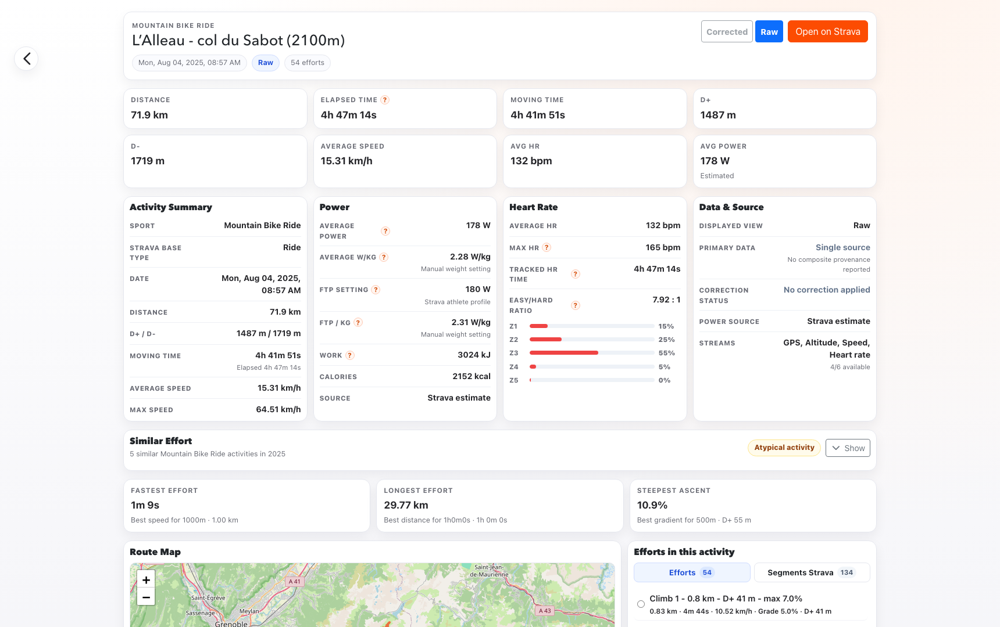

Map:

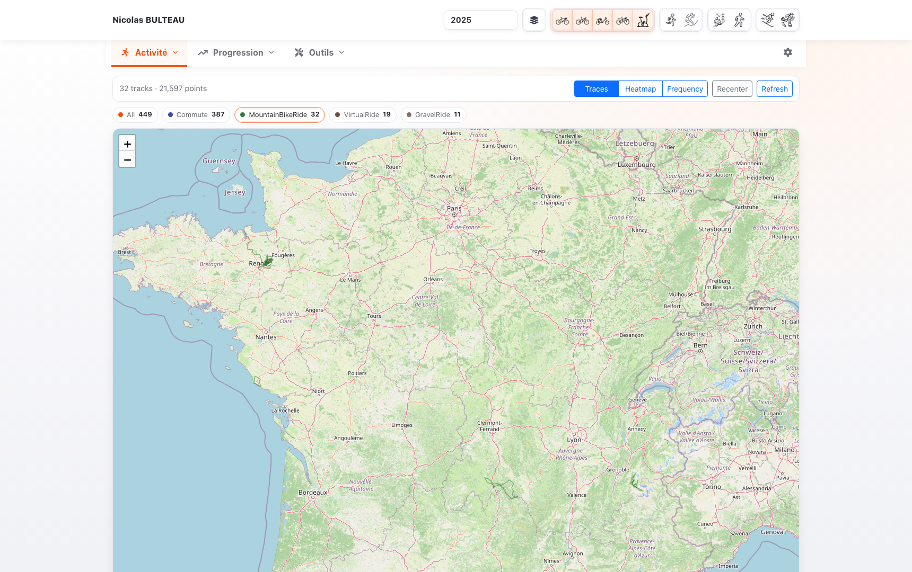

## Analysis

Statistics:

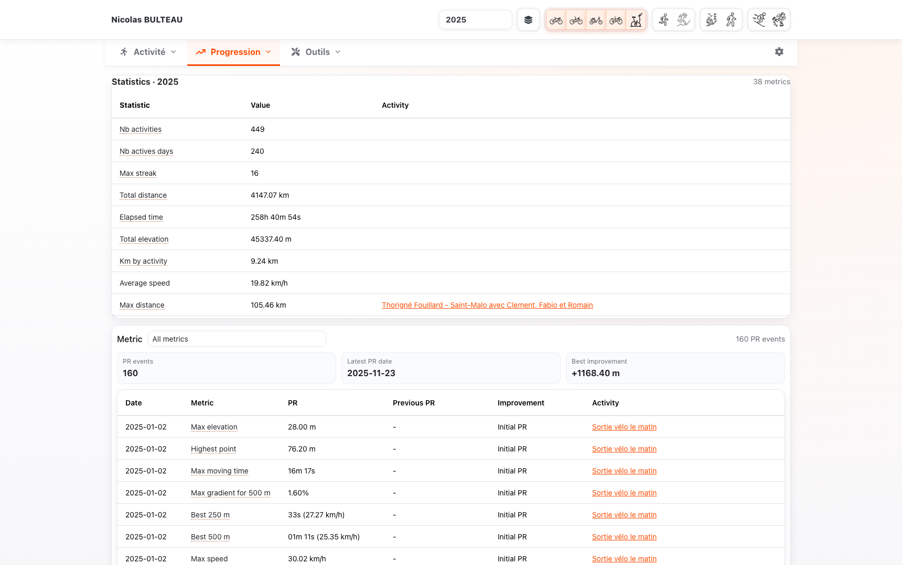

Trends:

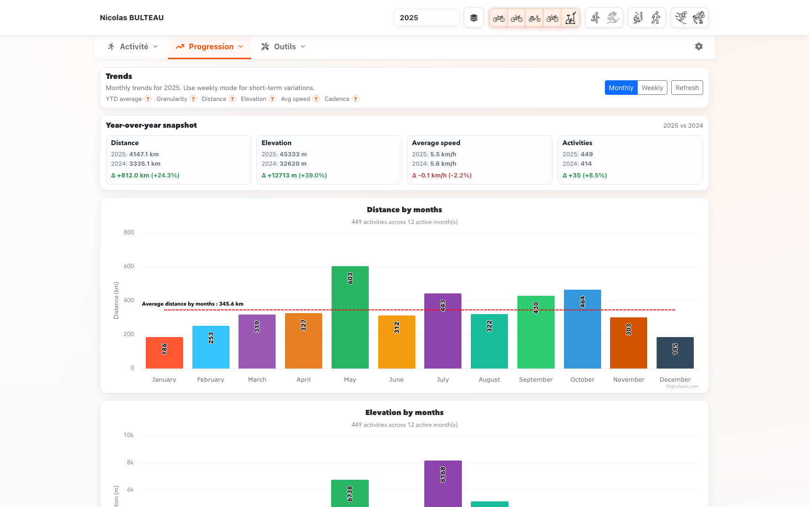

Heatmap:

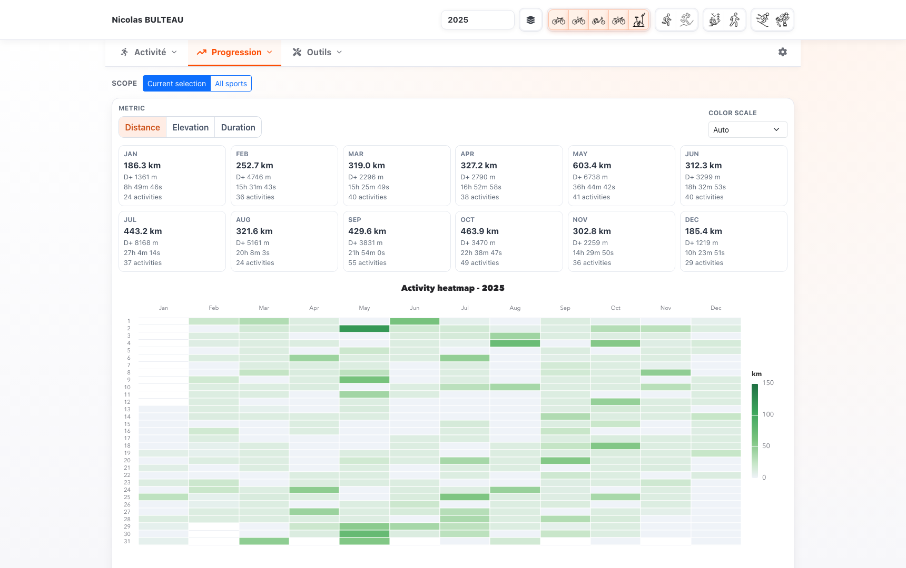

Segments:

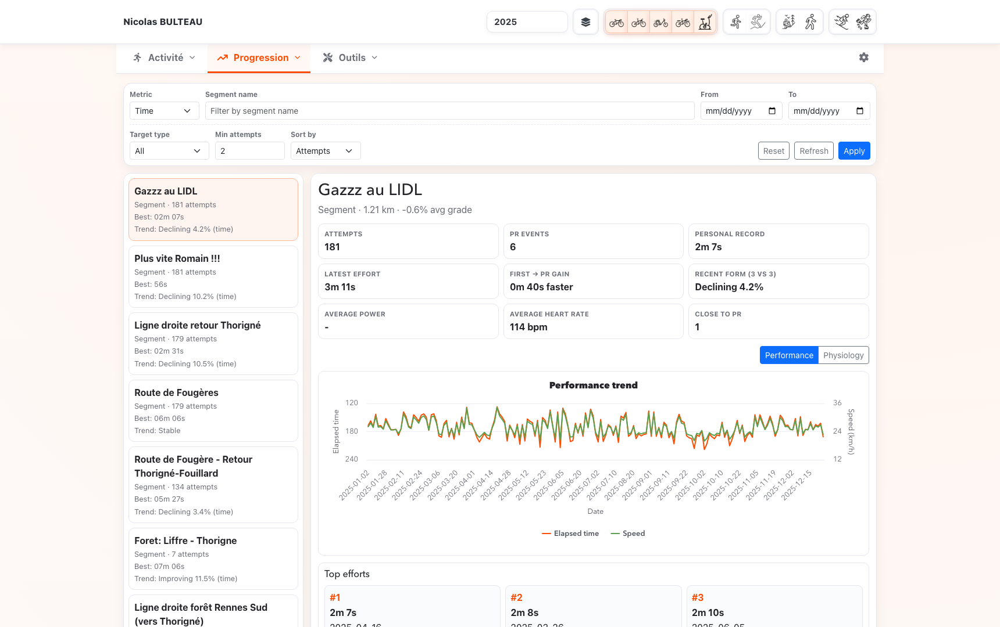

Badges:

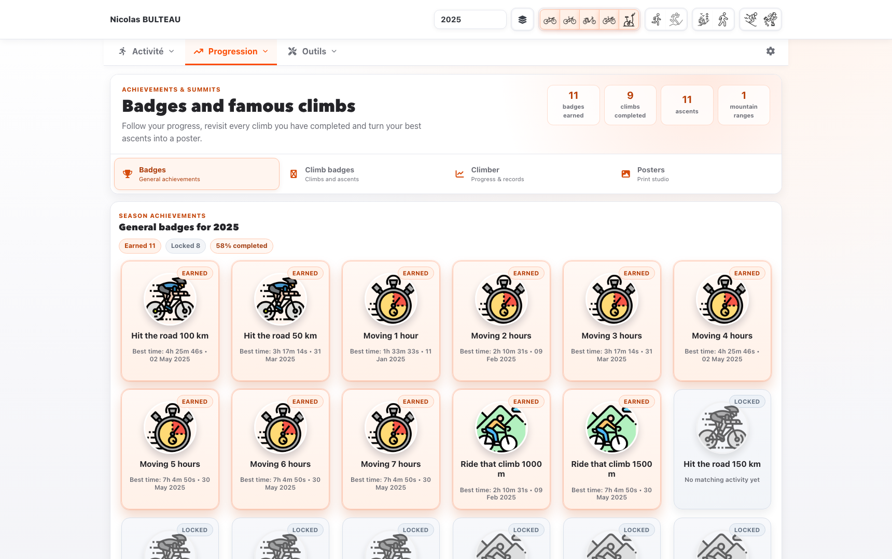

Equipment:

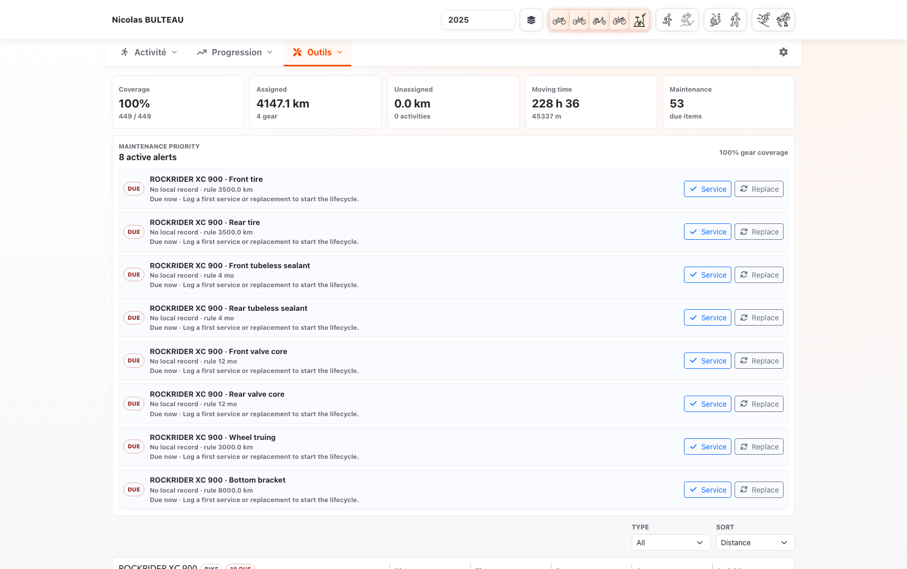

## Tools and configuration

GPS Art:

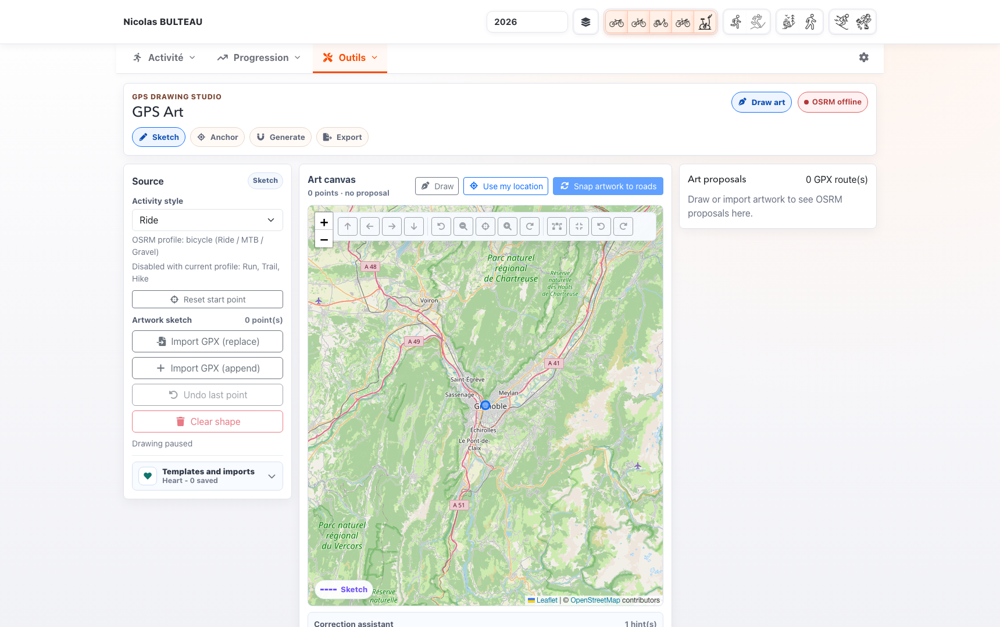

Settings:

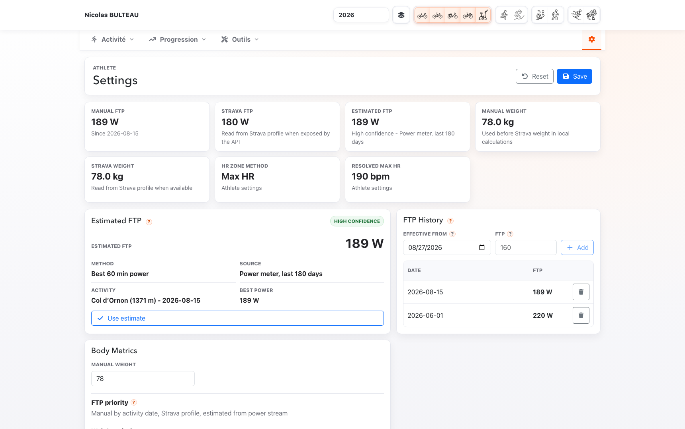

Status and diagnostics:

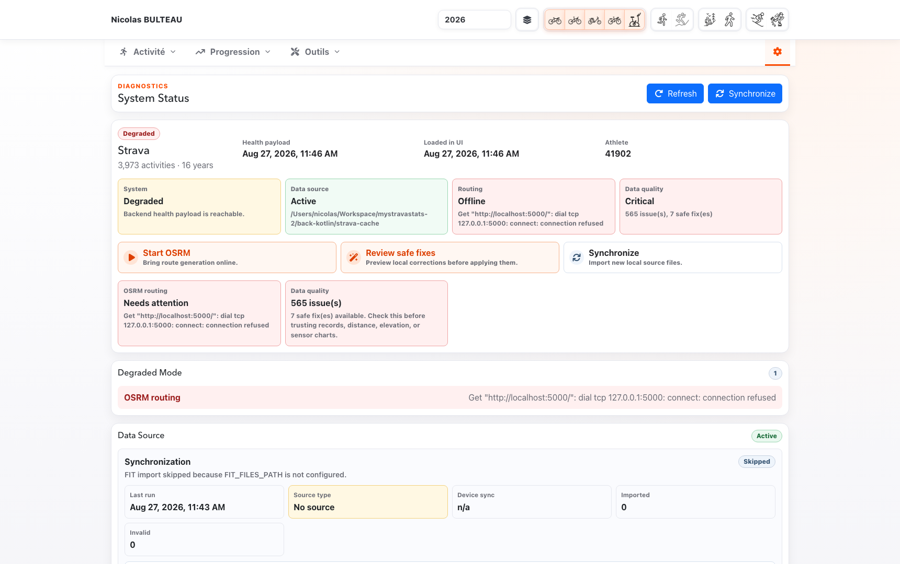

The detailed-activity screenshot uses activity `15340076302` from the local reference dataset.

To refresh screenshots, run:

```sh
node scripts/capture-doc-screenshots.mjs --year 2025 --activities all-cycling
```
